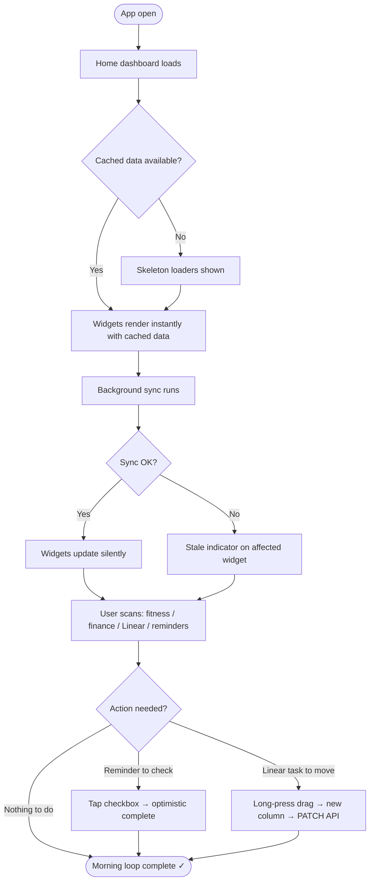
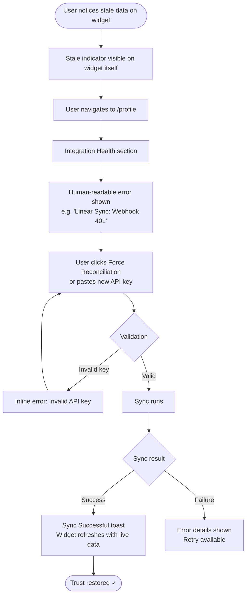
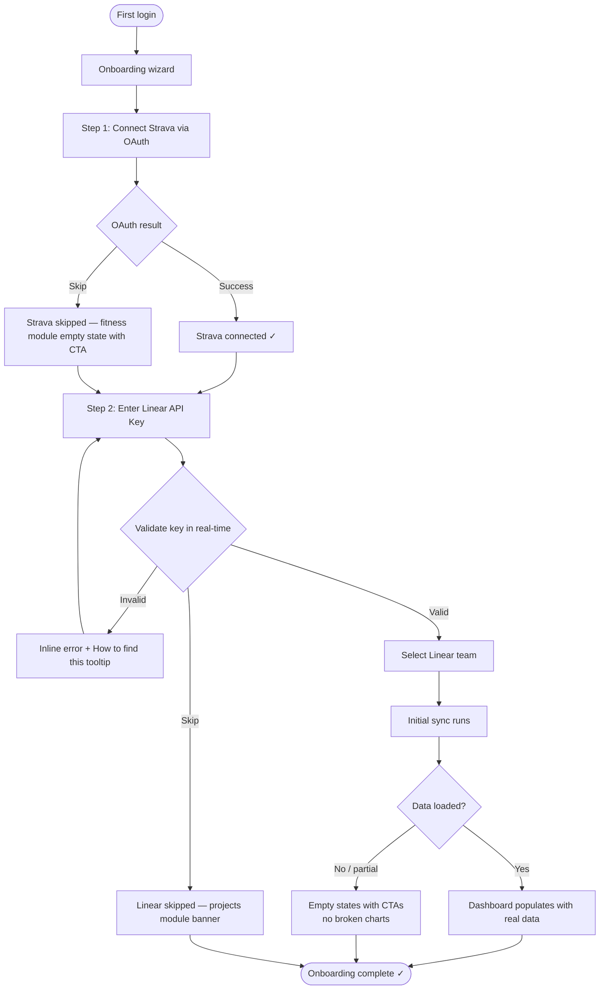

# UX Design Specification — ottoboard

**Author:** Marco
**Date:** 2026-03-19

---

<!-- UX design content will be appended sequentially through collaborative workflow steps -->

## Executive Summary

### Project Vision

Ottoboard is a personal "Control Center" — a modular PWA that eliminates digital fragmentation by consolidating fitness (Strava), finance (manual/CSV), and productivity (Linear) into a single interface. The core value proposition is **zero switch cost**: every critical action is reachable without leaving the app. The project is brownfield with Phases 1–8 fully operational; current UX focus covers Phase 9 (body measurements), Phase 10 (Linear integration + Reminders widget), and Phase 11 (Push Notifications).

### Target Users

**Primary — Marco (Owner/Power User):** Developer and athlete. Highly tech-savvy. Primarily accesses via mobile (PWA) during morning routine. Uses the app for rapid situational awareness, not deep analysis. Keyboard-first when on desktop. Core expectation: core actions completable in under 3 clicks from the home dashboard.

**Secondary — Beta Users:** Developer friends with similar technical profiles. Must be able to self-onboard (connect Strava/Linear API keys) without any developer intervention. Zero tolerance for empty states or broken charts after setup.

### Key Design Challenges

1. **Data Trust & Freshness Visibility** — The user must immediately understand whether displayed data is live or stale (when Linear/Strava APIs are offline). The "Integration Safety Net" journey makes this a first-class UX concern, not an error-handling afterthought.
2. **Mobile Kanban Complexity** — Touch-based drag-and-drop across columns is already implemented but remains critical. With Linear integration, the data model gains new visual elements (issue identifier, priority badge, assignee avatar) that must remain legible on small screens.
3. **BodyCanvas on Mobile** — Interactive SVG with tappable body zones is inherently challenging on small screens: hit areas must be generous, tooltips must not overflow the viewport, and the anterior/posterior toggle must be immediately discoverable.
4. **Reminders Widget as Self-Contained Action Center** — Must support create, complete, and archive operations entirely within the home dashboard widget, with no navigation required to another section.
5. **Beta User Onboarding** — The first-run wizard must validate API credentials in real-time before allowing access to main modules, ensuring no empty or broken states on first load.

### Design Opportunities

1. **"Morning Flow" in Under 60 Seconds** — Optimize the sequence: home → Linear widget → drag task to new state → confirmation toast. Eliminate every unnecessary tap.
2. **Integration Health as a Feature, Not an Error State** — Proactive status indicators in the Profile and within widgets surface sync state before failures occur, building ongoing trust rather than responding to breakdowns.
3. **Progressive Disclosure in Body Measurements** — All form fields are optional; users enter only what they measured today. The UI must make partial entry feel natural and complete, not incomplete.
4. **Self-Sufficient Reminders Widget** — Full CRUD lifecycle (create, complete, reopen, delete) accessible directly from the home widget without routing to a dedicated page.

## Core User Experience

### Defining Experience

The defining interaction of ottoboard is the **Morning Control Loop**: open the home dashboard, read the state of the day (yesterday's activity, current balance, Linear task status), perform one direct action (drag a task, check off a reminder, verify a balance) — all within 60 seconds, without ever navigating away from home. Every design decision must be evaluated against this loop: does it make it faster, clearer, or more trustworthy?

### Platform Strategy

- **Primary platform:** PWA, mobile-first (touch). The home screen experience is the most critical surface.
- **Secondary platform:** Desktop/keyboard. Power users expect keyboard navigation for all critical actions (tab, shortcuts, modal confirm).
- **Offline behavior:** Read-only cached data always visible; no UI blocking when external APIs (Linear, Strava) are unavailable. Stale data is shown with a clear freshness indicator, never silently.
- **Push notifications:** Native OS-level delivery via Service Worker, scheduled via Supabase Edge Function.
- **Browser support:** Modern evergreen only (Chrome, Safari 16.4+, Firefox, Edge). No legacy fallback required.

### Effortless Interactions

- **Home → action → done:** Every core action reachable in ≤ 3 taps/clicks from the home dashboard. No intermediate navigation screens.
- **Stale data at a glance:** Sync status visible directly on the affected widget — no need to visit the Profile to discover a broken integration.
- **Partial body measurements:** Entering only weight today feels complete, not incomplete. The form never demands fields the user doesn't have.
- **Reminder completion:** Single checkbox tap → optimistic update → done. No confirmation dialog, no page transition.

### Critical Success Moments

- **The "alive" dashboard:** Opening the home and seeing all data (fitness, finance, Linear) synchronized and current — this is the moment that validates the product's daily utility.
- **Beta user onboarding:** Wizard completes → real data appears immediately → zero empty states or broken charts. First impression must match a professional-grade tool.
- **Integration recovery:** User spots a stale indicator → navigates to Profile → pastes new key → "Force Reconciliation" → "Sync successful" toast. The failure path is as well-designed as the success path.

### Experience Principles

1. **The dashboard is the product** — the home is not a launcher, it's the destination. Widgets must be fully actionable, not just informational.
2. **Trust through transparency** — data freshness, sync status, and integration health are always visible. Never hide failure; surface it with a clear recovery path.
3. **Partial is valid** — no workflow forces completeness. Partial data entry, partial sync, partial onboarding — all are acceptable states that the UI handles gracefully.
4. **Speed over features** — every new element added to the home must earn its place by reducing time-to-insight or time-to-action. If it slows the morning loop, it doesn't belong on home.

## Desired Emotional Response

### Primary Emotional Goals

The primary emotional target for ottoboard is **lucid control**: the quiet, grounded feeling of knowing exactly where your money stands, how your body is performing, and what needs to be done today — with zero anxiety from incomplete or untrustworthy information. This is not excitement (a consumer product emotion) but the deeper satisfaction of a person who has their life organized and visible in one place. The benchmark experience: *"I opened the app, understood everything in 30 seconds, did one thing, and started my day."*

### Emotional Journey Mapping

| Stage | Target Emotion |
|---|---|
| Opening the home dashboard | Calm orientation, immediate situational awareness |
| Seeing synchronized, fresh data | Trust, reliability, "this is accurate" |
| Completing an action (task drag, reminder check) | Light satisfaction, sense of efficiency |
| Encountering a broken integration with clear recovery path | Recovered control — not frustration |
| Beta onboarding completed successfully | Professional impression, "this is serious software" |

### Micro-Emotions

- **Trust over skepticism** — the user must never wonder "is this number up to date?"
- **Confidence over confusion** — information hierarchy makes the most important data immediately obvious
- **Satisfaction over mere completion** — micro-interactions (checkbox, drag-and-drop) must feel physically rewarding, not neutral
- **Calm over urgency** — the dashboard informs, it does not alarm

### Design Implications

- **Trust → data freshness transparency:** Every widget displays its last sync timestamp or a live/stale indicator. Stale state is surfaced on the widget itself, never hidden in settings.
- **Lucid control → strict information hierarchy:** The most important metric per section is always the largest and most prominent element. Supporting data is secondary.
- **Satisfaction → micro-interaction feedback:** Reminder checkbox completion, Kanban drag-and-drop confirmation, and transaction save all have deliberate visual (and where possible haptic) feedback.
- **"No anxiety" → progressive disclosure:** No form field is mandatory beyond what is strictly required. Partial entries are valid and visually treated as complete, not as gaps to fill.

### Emotional Design Principles

1. **Inform, don't alarm** — status indicators use neutral or positive language by default; warnings appear only when action is required, not as ambient stress.
2. **Make success feel earned, not accidental** — completing the morning loop (checking all widgets, taking one action) should feel like a small but real win.
3. **Treat errors as recoverable moments** — error states are designed with the same care as success states: clear cause, clear next step, clear confirmation of resolution.
4. **Never make the user feel behind** — stale data, incomplete measurements, and missed reminders are presented without judgment; the UI focuses on what to do next, not on what wasn't done.

## UX Pattern Analysis & Inspiration

*Step skipped by user — no specific reference products identified. Design patterns will be derived from project context, existing codebase conventions, and PRD requirements.*

## Design System Foundation

### Design System Choice

**Custom design system built on Tailwind CSS 3.x.** No external component library. All components are hand-crafted in `src/components/ui/` and module-specific subdirectories. This is a brownfield project — the design system is already established and in production.

### Rationale for Selection

- **Speed & control:** Tailwind utility classes allow rapid iteration without fighting an external library's opinions.
- **Dark-first:** The entire UI is dark-mode-only (`bg-[#0a0a0f]` base), which is trivial with Tailwind and would require significant overriding with any pre-built component library.
- **Module color coding:** Each module has a distinct Tailwind color family, applied consistently across borders, glows, active states, and interactive elements. External libraries would complicate this theming.
- **PWA performance:** Zero CSS from unused component libraries. Only what's used is shipped.

### Module Color Palette (verified from codebase)

| Module | Route | Tailwind Color | Usage |
|---|---|---|---|
| Home | `/` | `slate-400` | Navigation accent |
| Fitness + Body | `/fitness` | `orange-400/500` | All fitness UI, body tab inherits |
| Finance | `/finance` | `emerald-400/500` | All finance UI |
| Projects | `/projects` | `purple-400/500` | Kanban, Linear UI |
| Habits | `/habits` | `teal-400/500` | All habits UI |
| Profile | `/profile` | `sky-400/500` | Profile sections |

### Implementation Approach

- **Base surface:** `bg-[#0a0a0f]` — near-black background
- **Cards/panels:** `bg-white/[0.03–0.05]` with `border border-white/[0.06–0.10]` — glassmorphism style
- **Sidebar:** `backdrop-blur-2xl` + `bg-white/[0.03]` — frosted glass fixed sidebar
- **Active states:** `bg-{color}/10` + `border-{color}/40` + `shadow-{color}/40 shadow-lg` — colored glow effect
- **Typography:** Geist font, `text-white/90` primary, `text-white/50` secondary, `text-gray-500` muted

### Customization Strategy

New UI elements for upcoming features must follow established patterns:
- Use the module's assigned color family for all interactive accents
- Apply `bg-white/5` + `border border-white/10` for card containers
- Use `rounded-xl` for cards, `rounded-lg` for smaller elements
- Hover states: `hover:bg-white/[0.04]` or `hover:bg-{color}/25`
- No new color families without explicit decision — use existing module palette

## 2. Core User Experience

### 2.1 Defining Experience

> *"Open the app in the morning and in one glance know how you're doing physically, how much you've spent, and what you need to do today — then act without ever leaving the home screen."*

Ottoboard's defining experience is **"one glance, then one tap"**: the home dashboard functions as a live operational cockpit that is also directly actionable. Unlike read-only dashboards, every widget supports at least one direct action (complete a reminder, drag a Linear task, check a balance) without navigating away. This is not a novel interaction paradigm — it is a well-established dashboard pattern executed with exceptional domain density across fitness, finance, and productivity.

### 2.2 User Mental Model

The user arrives at the app with the same mental model as reading a car dashboard: not continuous interaction, but instant state awareness. If something needs attention, it's visible immediately. If action is needed, it happens in-place.

**Mental model: "operational dashboard"** — not an app to explore, but a surface to read and act on.

**Key implication:** every widget must be self-explanatory. If a user has to navigate elsewhere to understand the state of a widget, the home experience has failed.

**Current workaround the app eliminates:** opening five separate apps (Strava, bank app, Linear, a reminder app, a habit tracker) every morning to get a full picture of the day.

### 2.3 Success Criteria

1. All home widgets display current data within 1.5 seconds of opening the app (cached data acceptable)
2. Integration status (Linear sync, Strava sync) is readable at a glance directly on the affected widget — no navigation to Profile required
3. At least 3 actions completable directly from the home (check reminder, drag Linear task, verify balance or fitness stat)
4. No silent empty states — every widget in an empty or error state shows a contextual CTA or status explanation
5. Morning loop completable in under 60 seconds: open → read → act → done

### 2.4 Novel UX Patterns

**Classification: Established patterns, innovative combination.**

The configurable widget dashboard is a proven pattern (Notion, Linear, Superhuman). Ottoboard's differentiation is not in the interaction model but in:

- **Cross-domain density:** fitness + finance + productivity on a single actionable surface
- **Full actionability:** widgets are not read-only; users can complete tasks, check off reminders, and interact with data in-place
- **Integration health as first-class UI:** sync status is a visible, recoverable UI state — not hidden in logs

No user education required for the core interaction. All patterns (widget drag-to-reorder, checkbox completion, Kanban drag-and-drop) are universally understood.

### 2.5 Experience Mechanics

**Core flow: Reminder completion (simplest action loop)**

1. **Initiation:** User opens home dashboard; RemindersWidget shows upcoming reminders sorted by due date
2. **Interaction:** User taps checkbox next to a reminder title
3. **Feedback:** Optimistic update — item visually marks as complete immediately; no loading state visible
4. **Completion:** Item moves to completed state or disappears from active list; count updates

**Core flow: Linear task state change (most complex action loop)**

1. **Initiation:** User sees KanbanColumnWidget on home; identifies a task to move
2. **Interaction:** Long-press (mobile) or drag (desktop) task card to new column
3. **Feedback:** Optimistic UI update; background PATCH to Linear API; GlobalLoadingBar signals background activity
4. **Completion:** Task appears in new column; Linear syncs; on error: rollback with toast error message

**Core flow: Integration failure recovery**

1. **Initiation:** Widget shows stale-data indicator ("Last sync: 3h ago" or error badge)
2. **Interaction:** User navigates to Profile → Integration section
3. **Feedback:** Clear human-readable error ("Linear Sync: Webhook 401 — Unauthorized"); "Force Reconciliation" button visible
4. **Completion:** User pastes new key → validation → "Sync Successful" toast → widget refreshes with live data

## Visual Design Foundation

### Color System

The color system is established and in production. No changes required — document as reference.

| Semantic Token | Value | Usage |
|---|---|---|
| Background base | `#0a0a0f` | Global page background |
| Surface card | `white/3–5%` | Panel and card containers |
| Border default | `white/6–10%` | Card borders, dividers |
| Text primary | `white/90` | Titles, key values |
| Text secondary | `white/50` | Labels, descriptions |
| Text muted | `gray-500` | Timestamps, secondary info |
| Error | `red-400/500` | Errors, destructive hover states |

**Ambient background:** Three fixed gradient blobs (`orange/5%`, `purple/5%`, `emerald/5%`) provide a warm, non-neutral tone to the base surface.

**Module accent colors (verified from codebase):**

| Module | Active color | Glow | Active bg |
|---|---|---|---|
| Home | `slate-400` | `slate-400/40` | `slate-400/10` |
| Fitness | `orange-400` | `orange-500/40` | `orange-500/10` |
| Finance | `emerald-400` | `emerald-500/40` | `emerald-500/10` |
| Projects | `purple-400` | `purple-500/40` | `purple-500/10` |
| Habits | `teal-400` | `teal-500/40` | `teal-500/10` |
| Profile | `sky-400` | `sky-500/40` | `sky-500/10` |

### Typography System

- **Typeface:** Geist (Next.js built-in), single-family system — no secondary font
- **Scale in use:**
  - Page title: `text-xl font-bold text-white/90`
  - Section header: `text-sm font-semibold text-white/80`
  - Body: `text-sm text-white/70`
  - Label/meta: `text-xs text-gray-500`
- **Line height:** Tailwind default (relaxed for body, snug for headings)
- **No custom font loading** — Geist is bundled with Next.js, zero FOUT risk

### Spacing & Layout Foundation

- **Base unit:** 4px (Tailwind default scale)
- **Page padding:** `p-4 md:p-6` — tighter on mobile, more breathing room on desktop
- **Section spacing:** `space-y-5` or `space-y-6`
- **Border radius:** `rounded-xl` (cards/panels), `rounded-lg` (buttons/inputs), `rounded-full` (badges/avatars)
- **Layout model:** Flexbox-based per page; no global CSS Grid
- **Glassmorphism pattern:** cards use `bg-white/[0.03–0.05]` + `border border-white/[0.06–0.10]` + optional `backdrop-blur`

### Accessibility Considerations

- **Keyboard navigation:** all critical actions are tab-navigable; focus management implemented
- **Screen reader support:** not a priority for this phase (PRD explicit — target is tech-savvy power users)
- **Contrast:** `white/90` on `#0a0a0f` passes WCAG AA for large text; `white/50` is borderline for small text — accepted tradeoff for the aesthetic and user profile
- **Touch targets:** mobile interactive elements use minimum `h-9` / `p-2.5` to meet touch target guidelines

## Design Direction Decision

### Design Directions Explored

*Step skipped — brownfield project. Visual design direction is already established and in production. No exploration of alternatives was necessary.*

### Chosen Direction

**Glassmorphism Dark Dashboard** — the existing production design:

- Near-black base (`#0a0a0f`) with frosted-glass sidebar (`backdrop-blur-2xl`)
- Cards and panels as semi-transparent layers (`bg-white/[0.03–0.05]`) with subtle white borders
- Module-specific color accents applied to icons, borders, glows, and active states
- Ambient gradient blobs in the background provide depth without noise
- Typography: single-family (Geist), restrained weight hierarchy

### Design Rationale

The existing direction was chosen during initial development and has been validated through daily personal use across Phases 1–12. It achieves the emotional goals defined in Step 4:
- **Lucid control** → high-contrast data on dark background, nothing competes for attention
- **Trust** → consistent color coding per module creates instant spatial orientation
- **"Not alarming"** → soft glow accents rather than loud colors; warnings stand out because the base is deliberately quiet

### Implementation Approach

All new UI surfaces (future phases, new widgets, edge case screens) must follow the established patterns:
- Use the relevant module's color family for all accents
- Apply `bg-white/5 border border-white/10 rounded-xl` for any new card container
- Never introduce new base colors — only the six established module palettes plus semantic red for errors
- Match existing touch target sizes, padding conventions, and border radius scale

## User Journey Flows

### Journey 1 — "Morning Control Center"

The primary daily loop: open → read → act → done in under 60 seconds without leaving the home screen.

### Journey 2 — "Integration Safety Net"

Recovery flow when sync is broken: transparent failure, clear path to resolution, trust restored.

### Journey 3 — "Beta User Onboarding"

First-run experience: wizard guides through Strava + Linear setup, no empty states after completion.

### Journey Patterns

| Pattern | Application |
|---|---|
| **Optimistic update** | Reminder checkbox, Kanban drag, habit toggle — immediate feedback, automatic rollback on error |
| **Stale indicator in-widget** | Sync status visible directly on the affected widget, never hidden in settings |
| **Inline validation** | API key fields, measurement forms — contextual error at the field level, not on submit |
| **Contextual CTA on empty state** | Every empty widget surfaces the right next action, never a silent blank state |
| **Toast + background refresh** | Non-blocking confirmation of impactful actions (sync, save) followed by silent data refresh |

### Flow Optimization Principles

1. **Entry from home** — all critical journeys are reachable from the home dashboard without drilling into module pages
2. **Failure paths are designed, not afterthoughts** — every error state has an equal-quality recovery path
3. **Skip is always valid** — onboarding and forms never force completion; skipped steps show contextual CTAs later
4. **Feedback before round-trip** — optimistic updates make actions feel instant; server confirmation happens silently

## Component Strategy

### Design System Components

All base components are custom-built on Tailwind CSS — no external library. The following are established and reusable across modules:

**Base UI (`src/components/ui/`):** `Button`, `Card`, `Select` (with `dropUp` prop), `GlobalLoadingBar`, `Sidebar`, `BottomNav`

**Shared patterns already implemented:**
- `WidgetShell` — DnD wrapper with drag handle, section link, configure, remove-with-confirm
- `bare` prop pattern — removes outer card wrapper when component is used inside `WidgetShell`
- Calendar heatmap grid — used in both `ActivityHeatmap` and `HabitHeatmap`
- Modal pattern — used in `HabitCreateModal`, `HabitEditModal`, `ReminderCreateModal`, etc.
- Optimistic toggle pattern — used in `HabitRow`, `ReminderRow`

### Custom Components

**Existing domain components (verified from codebase):**

| Module | Key Components |
|---|---|
| Fitness | `LastActivityCard`, `WeekStatsCard`, `ActivityHeatmap`, `BodyCanvas`, `BodyMeasurementsTab`, `MeasurementForm`, `WeightChart`, `BodyCompositionChart`, `BodyFatChart`, `CircumferencesRadarChart`, `MeasurementsDeltaChart`, `SkinfoldsTrendChart` |
| Finance | `MonthlyHeader`, `TransactionForm`, `SpendingPieChart`, `TotalBalanceWidget`, `MonthFinanceWidget` |
| Projects | `KanbanBoard`, `TaskCard`, `ProjectSidebar`, `MobileProjectBar`, `LinearNotConnectedBanner` |
| Habits | `HabitsContent`, `HabitRow`, `HabitHeatmap`, `HabitCreateModal`, `HabitEditModal` |
| Home | `WidgetShell`, `AddWidgetModal`, `RemindersWidget`, `KanbanColumnWidget` |

**Gap components — missing or unverified:**

| Component | Gap | Priority |
|---|---|---|
| `SyncStatusBadge` | In-widget stale/live indicator — "trust through transparency" principle | High |
| `IntegrationHealthCard` | Human-readable sync log with status per integration in `/profile` | High |
| `ForceReconciliationButton` | Explicit CTA for Linear reconciliation in `/profile` | High |
| `OnboardingWizard` | Multi-step first-run flow for beta users (Journey 3) | Medium |
| `NotificationPermissionBanner` | Non-invasive push permission prompt in home | Medium |

### Component Implementation Strategy

- **Extend, don't replace** — all new components must follow the existing `bg-white/5 border border-white/10 rounded-xl` card pattern
- **Module color inheritance** — new components in a module use that module's color family; no ad-hoc colors
- **State completeness** — every new component must implement: default, loading/skeleton, empty+CTA, error+recovery
- **Mobile first** — minimum touch target `h-9 px-3`; test on mobile before desktop
- **bare prop** — any component that may be used inside `WidgetShell` must support `bare?: boolean`

### Implementation Roadmap

**Priority 1 — Trust & Recovery (supports Journey 2):**
- `SyncStatusBadge` — add to `KanbanColumnWidget`, `LastActivityCard`
- `IntegrationHealthCard` + `ForceReconciliationButton` — `/profile` integrations section

**Priority 2 — Onboarding (supports Journey 3):**
- `OnboardingWizard` — verify and complete multi-step beta onboarding flow

**Priority 3 — Notifications (supports Phase 11 polish):**
- `NotificationPermissionBanner` — home dashboard, dismissible, respects localStorage state

## UX Consistency Patterns

### Button Hierarchy

| Level | Style | Usage |
|---|---|---|
| Primary | `bg-{color}/15 border border-{color}/25 text-{color}` + hover `bg-{color}/25` | Main action in context (e.g., "New", "Save") |
| Ghost / Secondary | `text-white/50 hover:text-white/80 hover:bg-white/[0.04]` | Secondary actions, navigation |
| Destructive | `text-white/30 hover:text-red-400 hover:bg-red-500/10 hover:border-red-500/20` | Delete, logout |
| Icon-only | `w-8 h-8 rounded-lg flex items-center justify-center` | Compact actions (collapse, close, drag handle) |

Color in primary buttons always matches the active module's color family.

### Feedback Patterns

| Situation | Pattern |
|---|---|
| Action completed | Non-blocking toast, auto-dismiss |
| Data loading | Skeleton pulse — `animate-pulse bg-white/5 rounded h-9` |
| Background sync | `GlobalLoadingBar` — top of viewport, appears when `useIsFetching() > 0` |
| Optimistic update | Immediate UI change; silent rollback on error with toast |
| Stale data | In-widget `SyncStatusBadge` — to be implemented |
| Integration error | Human-readable message + recovery CTA in `/profile` |

### Form Patterns

| Pattern | Rule |
|---|---|
| Validation | Inline at field level, not on submit |
| Optional fields | No asterisk, no "incomplete" messaging — partial entry is valid and complete |
| Destructive confirm | Inline confirm ("Remove?" → "Confirm" / "Cancel") — never a separate modal |
| Select near bottom edge | `dropUp={true}` — menu opens upward with `bottom-full mb-1` |
| Container with Select | Never `overflow-hidden` — clips the dropdown |

### Navigation Patterns

| Context | Pattern |
|---|---|
| Desktop | Fixed left sidebar, collapsible to icon-only mode |
| Mobile | Bottom navigation + top header with user/logout |
| Active route | `bg-{color}/10 border-{color}/40 shadow-{color}/40 shadow-lg` glow effect |
| Module sub-sections | Horizontal tabs in-page (e.g., `/fitness`: Strava / Body) |

### Empty States & Loading

- **Always with contextual CTA** — never a silent blank state; every empty widget explains why and what to do next
- **Skeleton loaders before data** — `animate-pulse` placeholders, never a blocking spinner
- **Empty state anatomy:** module icon in `text-gray-700` + short message + CTA link or button

### Modal & Overlay Patterns

- **No navigation for actions** — everything happens in-place via modals or inline UI
- **Destructive confirm** — inline within the widget or row, not a separate modal
- **Form modals** — internal scroll for long content; sticky footer with primary CTA
- **Dismiss** — always via explicit close button or Escape key; no accidental dismiss on backdrop click for destructive actions

## Responsive Design & Accessibility

### Responsive Strategy

**Mobile-first** approach. Single breakpoint (`md:` = 768px Tailwind default) covers all adaptation needs. No intermediate tablet breakpoint — layouts adapt naturally.

| Device | Breakpoint | Layout | Navigation |
|---|---|---|---|
| Mobile | `< 768px` | Single column, `p-4` padding | Bottom nav (5 items) + top header with user/logout |
| Tablet / Desktop | `≥ 768px` (`md:`) | Multi-column where applicable, `p-6` padding | Fixed left sidebar (`w-[220px]` expanded / `w-[72px]` collapsed) |

**Main layout offset:**
- Mobile: `pt-14 pb-16` — clears top header and bottom nav
- Desktop: `md:pt-0 md:pb-0` — no offset needed

### Breakpoint Strategy

**Single breakpoint: `md:` (768px)**

All responsive adaptation uses this single threshold. Key patterns from codebase:
- `hidden md:flex` — sidebar desktop only
- `md:hidden` — bottom nav / top header mobile only
- `p-4 md:p-6` — padding scale
- `hidden md:flex` / `flex md:hidden` — component visibility switching

**Module-specific responsive adaptations:**
- `/projects` — `ProjectSidebar` hidden on mobile; `MobileProjectBar` shown instead
- `/fitness` — horizontal tabs (Strava / Body) same layout on both breakpoints
- Home widgets — 1-column mobile, multi-column desktop via CSS Grid or Flexbox wrap

### Accessibility Strategy

**Target: WCAG AA partial** — conscious tradeoff documented in PRD. Target audience is tech-savvy power users; screen reader support is explicitly out of scope for current phases.

| Requirement | Status | Notes |
|---|---|---|
| Keyboard navigation | ✅ Implemented | All critical actions are tab-navigable |
| Touch target size | ⚠️ Accepted tradeoff | Min `h-9 px-3` (~36px) — slightly below 44px WCAG recommendation |
| Color contrast (large text) | ✅ Passes AA | `white/90` on `#0a0a0f` |
| Color contrast (small text) | ⚠️ Borderline | `white/50` on `#0a0a0f` — accepted for aesthetic and user profile |
| Screen reader support | ❌ Out of scope | Explicitly excluded from PRD for this phase |
| Focus indicators | ✅ Active | Browser default focus ring preserved |
| Hydration warnings | ✅ Handled | `suppressHydrationWarning` on dynamic content elements |

### Testing Strategy

| Test Type | Method |
|---|---|
| Responsive layout | Chrome DevTools device emulation + real device test (iOS PWA installed) |
| Touch targets | Manual test on mobile for all interactive elements |
| Keyboard navigation | Manual tab traversal across all pages |
| Browser support | Chrome, Safari 16.4+, Firefox, Edge — no legacy support |
| PWA installation | Add to Home Screen test on iOS Safari and Chrome Android |
| Push notifications | Real device test — iOS 16.4+ required for Safari |

### Implementation Guidelines

- Use Tailwind's `md:` prefix for all responsive variants — no custom media queries
- Always test new UI on mobile before desktop — mobile is the primary surface
- Respect `hidden md:flex` / `md:hidden` visibility pattern for navigation components
- New interactive elements: minimum `h-9` height, `px-3` horizontal padding
- Never use `overflow-hidden` on containers that include `Select` dropdowns
- Add `overflow-y-hidden` explicitly when using `overflow-x-auto` to prevent CSS spec side effect
